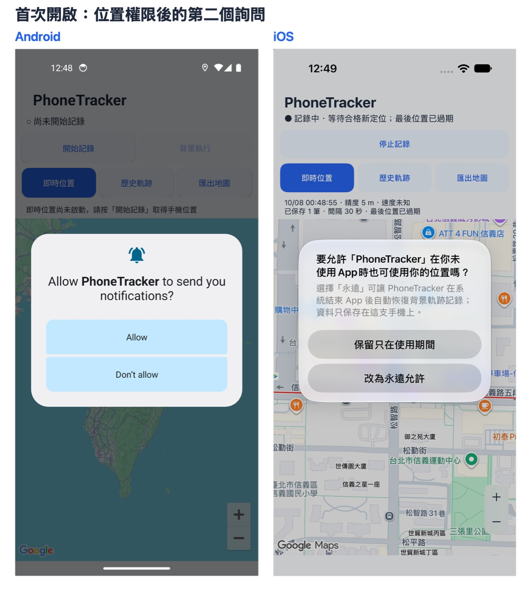
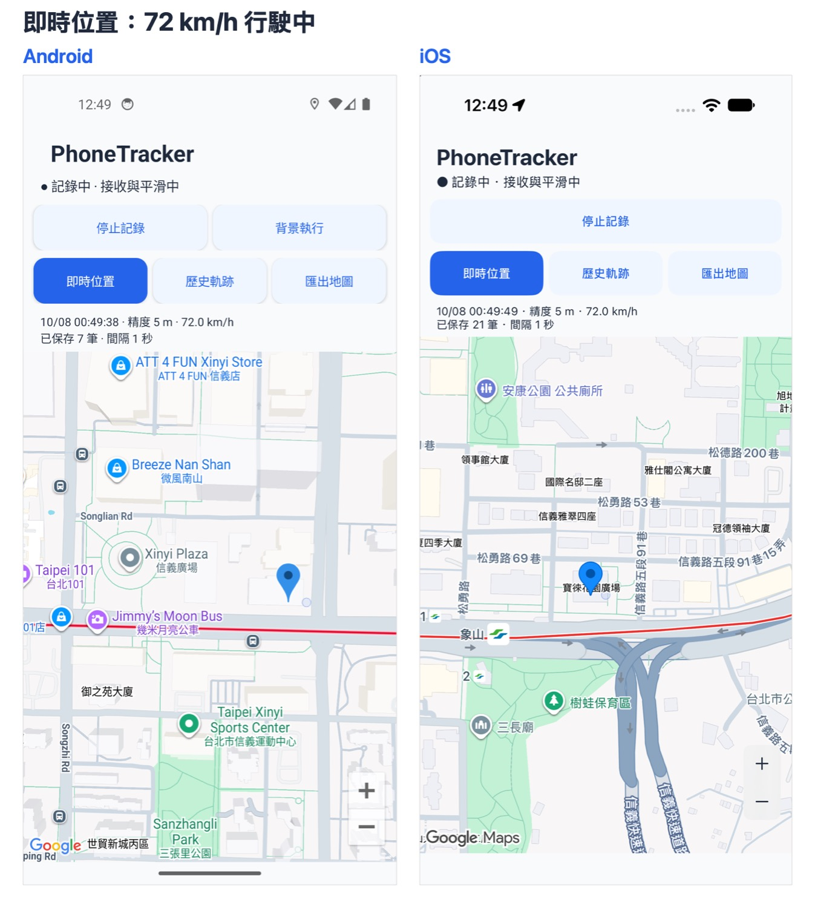
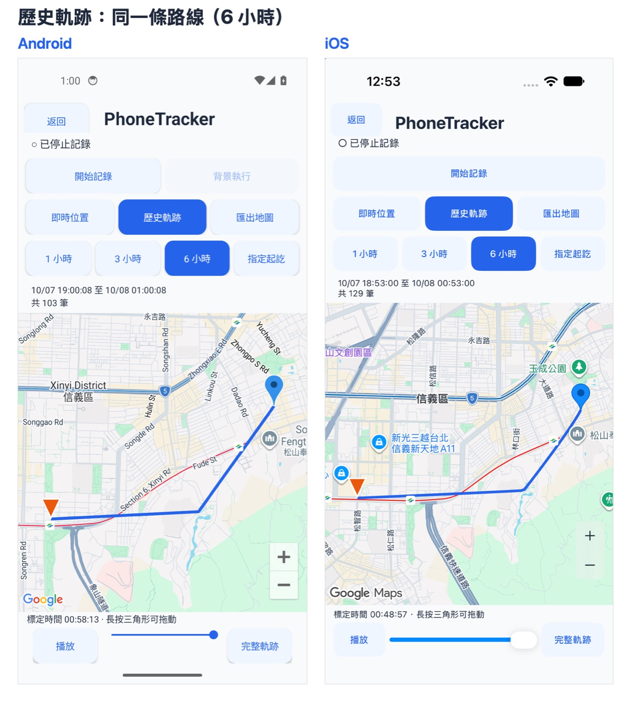
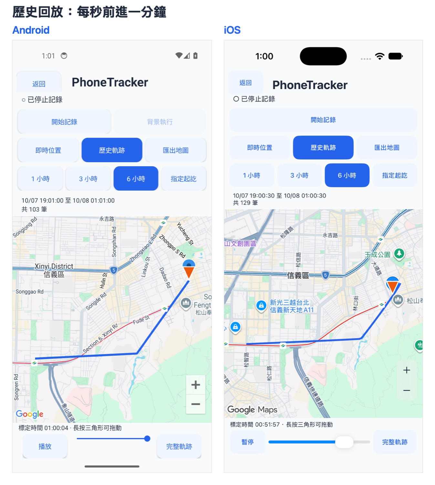
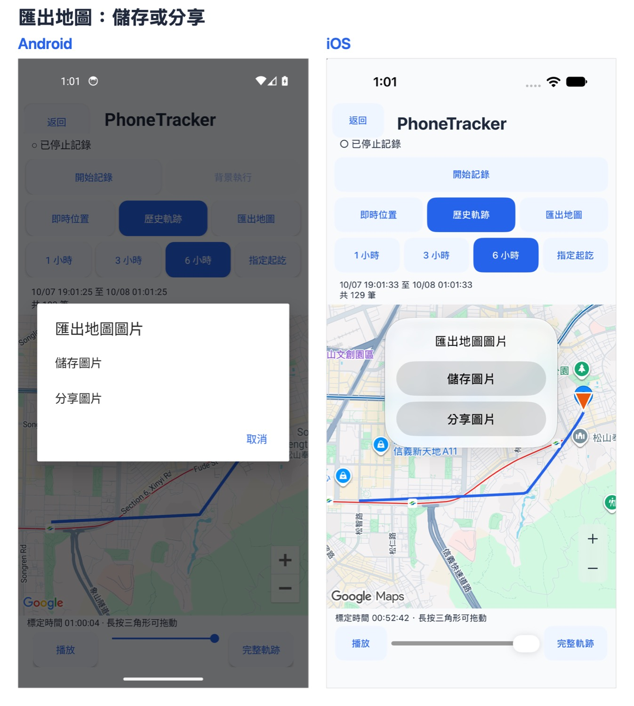
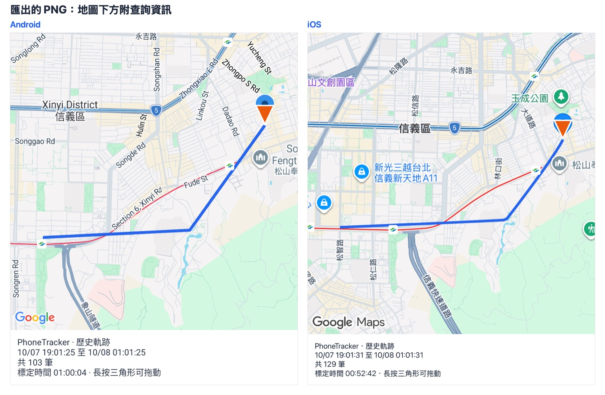
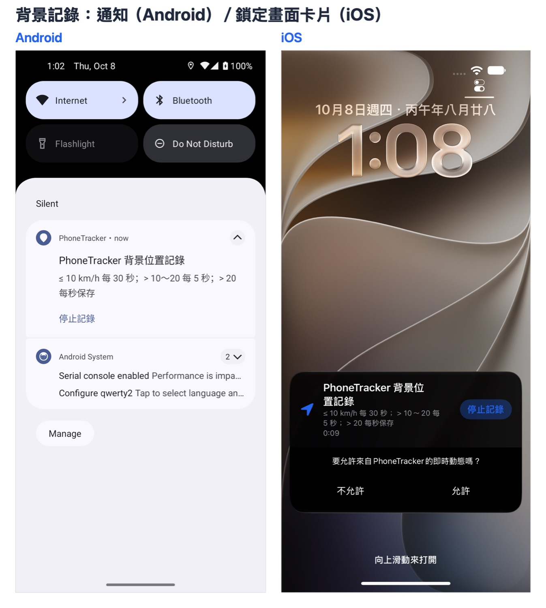

# iOS 與 Android 功能對照

2026-10-08 在同一台 Mac 上並排測試：Android 模擬器（Pixel 4a，Android 14）與 iOS 模擬器（iPhone 18 Pro，iOS 27），兩邊同時跑同一條路線（信義路往東，72 km/h）。左邊是 Android，右邊是 iOS。

Android 模擬器的系統語言是英文，所以權限對話框和部分地圖標籤是英文；App 本身兩邊都是繁體中文。

## 結果總覽

| 功能 | Android | iOS | 一致 |
| --- | --- | --- | --- |
| 單元測試 | 21 項通過 | 23 項通過（21 項逐條移植 + 2 項資料庫測試） | ✅ |
| 估算位置（精度不足仍顯示、標示「未寫入軌跡」、30 秒才算過期） | Google 融合定位 | CoreLocation（同樣結合 GPS／Wi-Fi／基地台） | ✅ |
| 精度門檻、三點平滑、跳點拒收、靜止鎖定 | — | 同一組測試 | ✅ |
| 記錄間隔（讀資料庫核對） | 72 km/h 約每 1 秒 | 72 km/h 約每 1 秒；14.4 km/h 每 5 秒；慢速每 30 秒 | ✅ |
| 地圖 | Google Maps | Google Maps | ✅ |
| 即時位置、精度圈、跟隨、手動拖地圖停止跟隨 | ✅ | ✅ | ✅ |
| 歷史 1／3／6 小時、指定起訖、分段 | ✅ | ✅ | ✅ |
| 回放（每秒一分鐘）、完整軌跡、拖動三角形 | ✅ | ✅ | ✅ |
| 匯出 PNG（地圖 + 下方說明）、儲存／分享 | ✅ | ✅ | ✅ |
| 背景記錄、停止記錄 | 前景服務通知 | 鎖定畫面／動態島卡片 | 形式不同，功能相同 |
| 底部藍色導覽列 | 有 | 無（iOS 沒有導覽按鈕，只有主畫面橫條） | 平台差異 |
| 「背景執行」按鈕 | 有 | 無（iOS 不允許 App 自行關閉，回主畫面即可） | 平台限制 |
| 第二個權限詢問 | 通知權限 | 是否改為「永遠」允許位置 | 平台差異 |
| 從多工畫面滑掉後繼續記錄 | 會 | 精確 GPS 會停止；位置權限為「永遠」時，明顯移動後由系統喚醒恢復 | 平台限制 |

## 截圖

### 首次開啟

### 即時位置（72 km/h）

### 歷史軌跡

### 回放

### 匯出地圖

### 背景記錄

截圖拍攝於上游 `54edc13`（融合定位）之前；該更新的估算位置邏輯已同步移植並以單元測試驗證，iOS 即時畫面同樣會顯示「合格定位」／「估算位置，未寫入軌跡」。

兩邊的記錄筆數與軌跡範圍不同，是因為各自的資料庫累積了不同次的測試資料，不影響比較。
